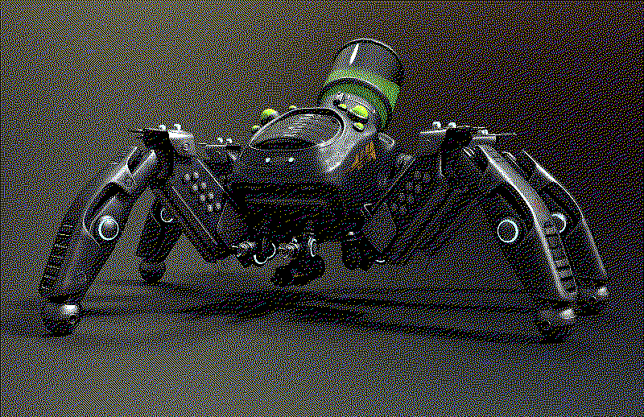

### GNU Open15 16.04 LTS (*Roach*)

| _Tiny Drone, common_ | 
|:-------------|
| _This 1kg self-printed and assembled drone is a legged crawler, and can fit into small spaces._ | 
| **Armor Class** 13 |
| **Hit Points** 10 (4d4) |
| **Speed** 20 ft., climb 20 ft.|
| **Standard Price:** 500 Kilobucks |
| **Damage Immunities:** Fire, Cold, Poison, Psychic, Necrotic |
| **Condition Immunities:** Frightened, Stunned |

<table class="abilities">
  <thead><tr><th>STR</th><th>DEX</th><th>CON</th><th>WIS</th><th>INT</th> <th>CHA</th>
    </tr>
  </thead>
  <tbody>
    <tr>
      <td>2 (-4)</td>
      <td>16 (+3)</td>
      <td>10 (+0)</td>
      <td>1 (-5)</td>
      <td>1 (-5)</td>
      <td>1 (-5)</td>
    </tr>
  </tbody>
</table>

| **Actions** |
|---|
| ***Skitter.***  You can avoid attacks extremely well because of your small size and agility, causing any creature to have disadvantage on attack rolls against you. This ability is suppressed if you are incapacitated, restrained, or otherwise unable to move. |

